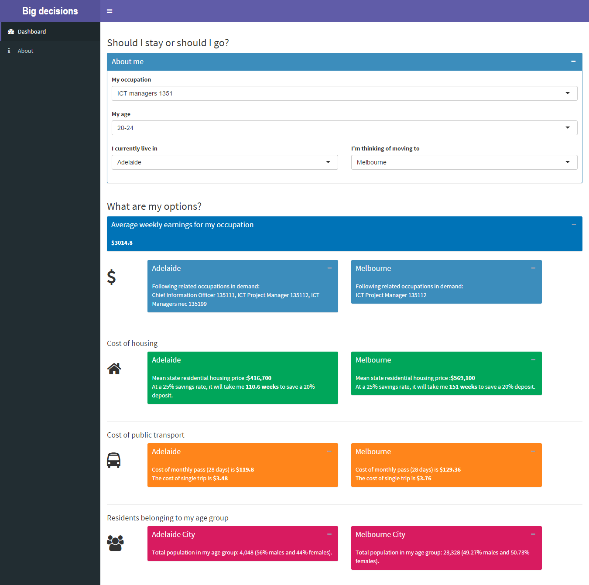

#### Project description

Young Australians are often faced with the big decision whether to stay in the city they were raised in, or move interstate for employment opportunities or to be with a loved one. It's a big life decision. But how do you decide? Should I stay or should I go?
Adelaide loses lots of young graduates. They may earn more interstate but what about housing affordability or lifestyle?
Our website pulls together relevant data points to help individuals reach a meaningful decision.

Team name: Data Dingoes
Team memebers: Ash, Cathy, Ben and Theresa
Hackerspace url: [https://hackerspace.govhack.org/content/should-i-stay-or-should-i-go] (http://www.abs.gov.au/AUSSTATS/abs@.nsf/DetailsPage/6306.0May%202014?OpenDocument)

Live url: [https://asheshwor.shinyapps.io/bigDecisions](https://asheshwor.shinyapps.io/bigDecisions)

If you have RStudion and Shiny installed, use the following command to run the app:

```R
shiny::runGitHub('BigDecisions', 'Unleashed2015')
````

<small>Screenshot of app's dashboard page</small>

#### Datasets used

*   Employee earnings and hours, May 2014 - ABS [http://www.abs.gov.au/AUSSTATS/abs@.nsf/DetailsPage/6306.0May%202014?OpenDocument](http://www.abs.gov.au/AUSSTATS/abs@.nsf/DetailsPage/6306.0May%202014?OpenDocument)
*   Residential dwellings: values, mean price and numbers by state and territories - ABS [http://data.gov.au/dataset/a03aaf19-dbf9-4f62-ab3b-9e2c1172d7d4](http://data.gov.au/dataset/a03aaf19-dbf9-4f62-ab3b-9e2c1172d7d4)
*   State nomination occupation list for Victoria - vic.gov.au [http://www.liveinvictoria.vic.gov.au/visas-and-immigrating/occupation-lists#.VZdEc_mqqko](http://www.liveinvictoria.vic.gov.au/visas-and-immigrating/occupation-lists#.VZdEc_mqqko)
*   State nomination occupation list for South Australia - migration.sa.gov [http://www.migration.sa.gov.au/Occupation/ExportOnListAsCsv?u=32d47673-962b-4ace-9375-9239878c4dab](http://www.migration.sa.gov.au/Occupation/ExportOnListAsCsv?u=32d47673-962b-4ace-9375-9239878c4dab)
*   Population by age and sex - data.sa.gov.au [https://data.sa.gov.au/data/dataset/population-by-age-and-sex/resource/f284c4d7-3dfc-4653-8eb8-88dcf854fd05](https://data.sa.gov.au/data/dataset/population-by-age-and-sex/resource/f284c4d7-3dfc-4653-8eb8-88dcf854fd05)
*   Metropolitan myki fares 2015 - ptv.vic.gov.au [http://ptv.vic.gov.au/tickets/metropolitan-myki-fares/](http://ptv.vic.gov.au/tickets/metropolitan-myki-fares/)
*   Adelaide Metro fares 2015 - adelaidemetro.com.au [https://www.adelaidemetro.com.au/28-Day-Pass/Fare-Comparisons](https://www.adelaidemetro.com.au/28-Day-Pass/Fare-Comparisons)
*   Net Interstate Migration, Calendar years 1997 to 2014 - data.gov.au [http://data.gov.au/dataset/net-interstate-migration-calendar-years-1997-to-2012/resource/f0e4a05c-180f-4d8a-bff1-5e045927ba20](http://data.gov.au/dataset/net-interstate-migration-calendar-years-1997-to-2012/resource/f0e4a05c-180f-4d8a-bff1-5e045927ba20)

#### Attribution for software and platforms used

*   R [http://cran.r-project.org/](http://cran.r-project.org/)
*   RStudio [http://www.rstudio.com/](http://www.rstudio.com/)
*   Shinyapps [http://shiny.rstudio.com/](http://shiny.rstudio.com/)
*   GitHub [https://github.com/](https://github.com/)
*   gimp [http://www.gimp.org/](http://www.gimp.org/)
*   adobe premier pro [https://www.adobe.com/au/products/premiere.html](https://www.adobe.com/au/products/premiere.html)
*   slack [slack.com](slack.com)
*   Active presenter [http://atomisystems.com/activepresenter/](http://atomisystems.com/activepresenter/)
*   Font Awesome [http://fortawesome.github.io/Font-Awesome/](http://fortawesome.github.io/Font-Awesome/)

#### Source code

GitHub repository[https://github.com/Unleashed2015/sisosig](https://github.com/Unleashed2015/sisosig)